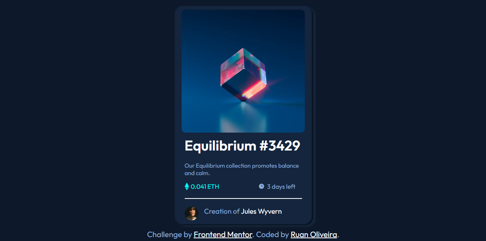

# Frontend Mentor - NFT preview card component solution

This is a solution to the [NFT preview card component challenge on Frontend Mentor](https://www.frontendmentor.io/challenges/nft-preview-card-component-SbdUL_w0U). Frontend Mentor challenges help you improve your coding skills by building realistic projects. 

## Table of contents

- [Overview](#overview)
  - [The challenge](#the-challenge)
  - [Screenshot](#screenshot)
  - [Links](#links)
- [My process](#my-process)
  - [Built with](#built-with)
  - [Continued development](#continued-development)
- [Author](#author)

## Overview

### The challenge

Users should be able to:

- View the optimal layout depending on their device's screen size
- See hover states for interactive elements

### Screenshot

### Links

- Solution URL: [Add solution URL here](https://your-solution-url.com)
- Live Site URL: [Add live site URL here](https://ruansilvaolv.github.io/nft-preview-card-component/)

## My process

### Built with

- CSS custom properties
- Flexbox

### Continued development

I want to continue practicing Flexbox and Grid, in addition to improving Hover techniques, I will continue to study CSS in general.

## Author

- GitHub - [Ruan Oliveira](https://github.com/ruansilvaolv)
- Frontend Mentor - [@ruansilvaolv](https://www.frontendmentor.io/profile/ruansilvaolv)
- LinkedIn - [Ruan Oliveira](https://linkedin.com/in/ruansilvaolv)
